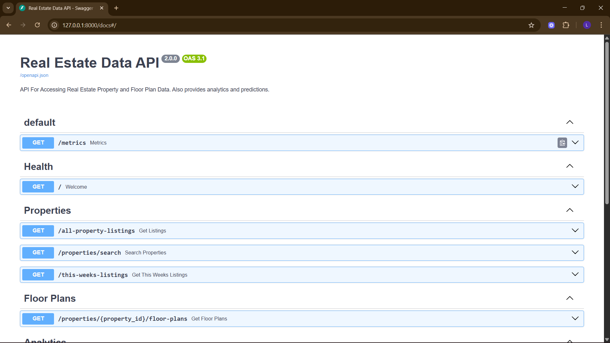
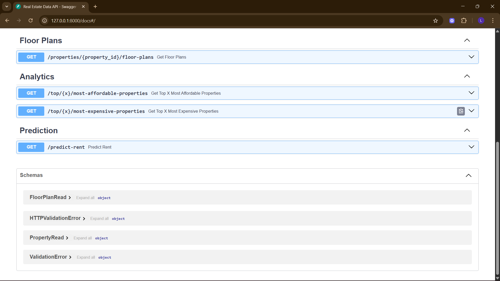
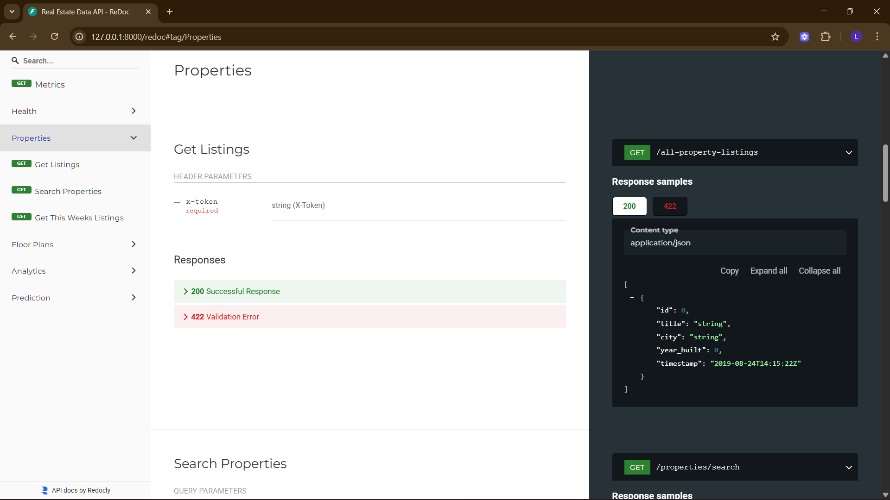
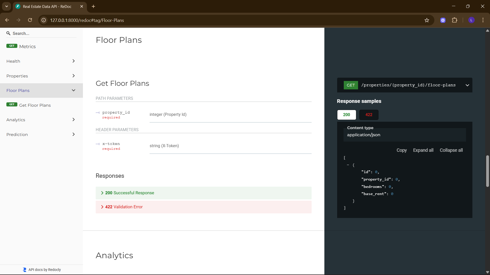
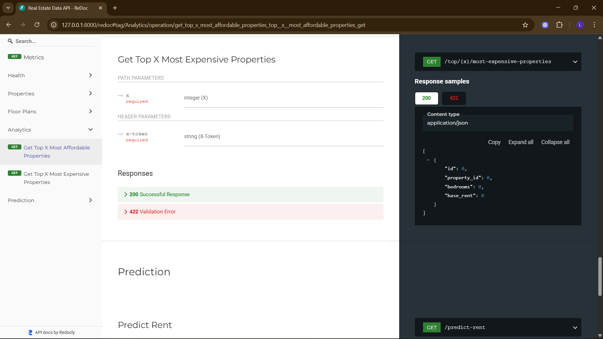
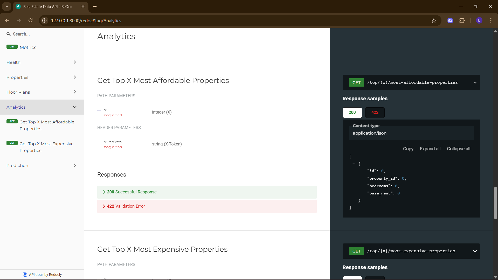
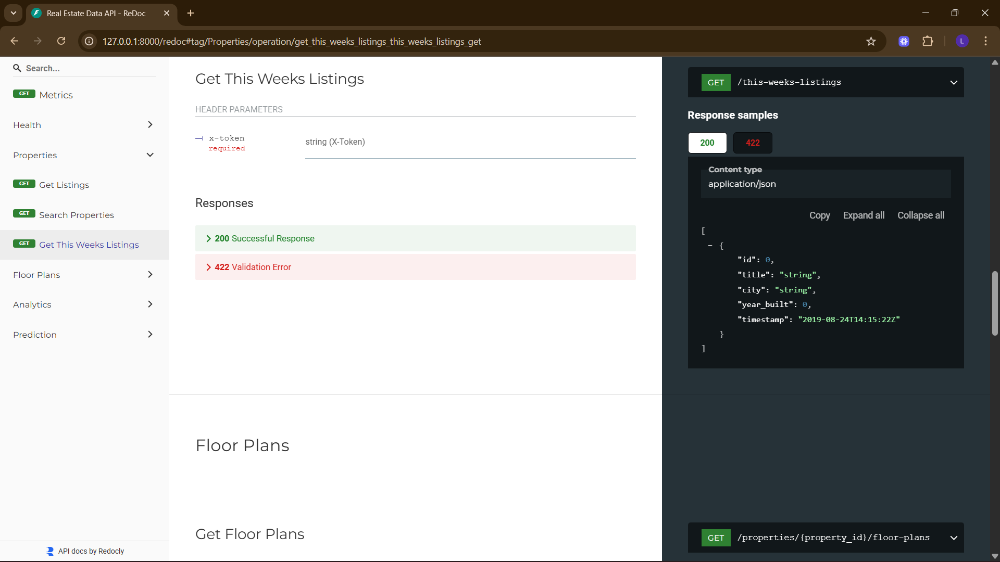
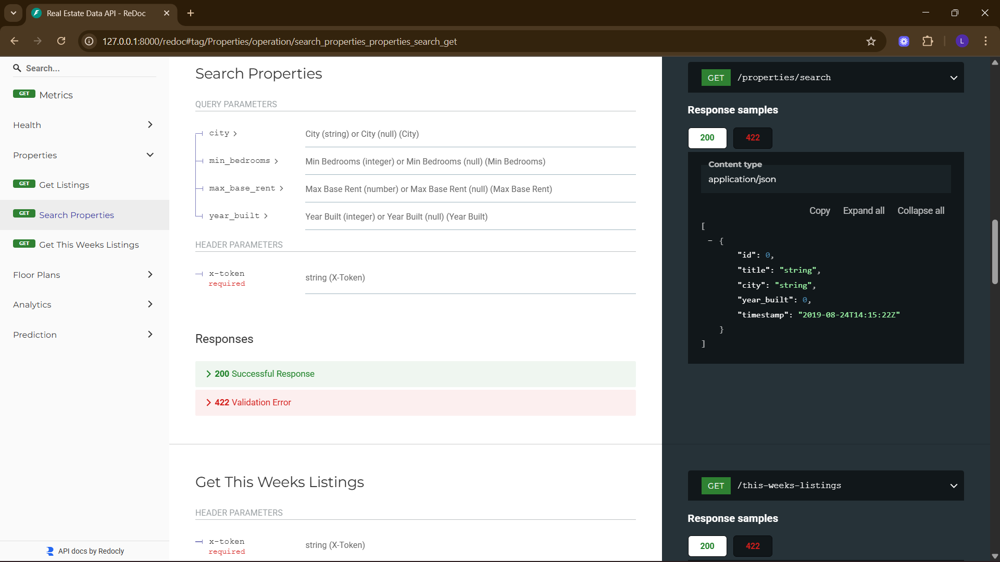
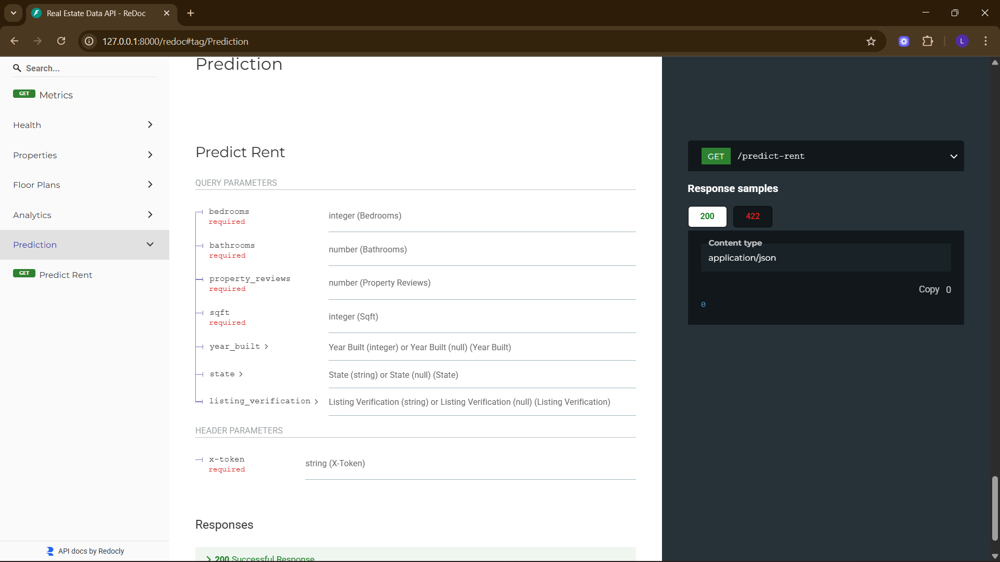

# 📡 API Reference

The API is powered by **FastAPI** and fully documented via OpenAPI/Swagger.

---

## 🔒 Authentication
- All endpoints require an `X-Token` header.
- Value must match `API_TOKEN` environment variable.

---




## 🏡 Properties
### GET `/properties/`
- Returns list of all properties.



### GET `/properties/{id}/floor-plans`
- Returns floor plans for a given property.
- 404 if not found.


---

## 📊 Analytics
### GET `/analytics/top/{x}/most-affordable`
- Returns top `x` cheapest floor plans.



### GET `/analytics/top/{x}/most-expensive`
- Returns top `x` most expensive floor plans.


### GET `/analytics/this-weeks-listings`
- Listings added in last 7 days.



### GET `/analytics/search`
- Search by filters:
  - `city`
  - `min_bedrooms`
  - `max_base_rent`
  - `year_built`



---

## 🔮 Predictions
### GET `/predict/rent`
- Input: bedrooms, bathrooms, sqft, state, year_built
- Output: predicted rent price.




Example:
```bash
curl -X GET "http://localhost:8000/predict/rent?bedrooms=2&bathrooms=1&sqft=800&state=CA&year_built=2010" \
  -H "X-Token: your_api_token"

