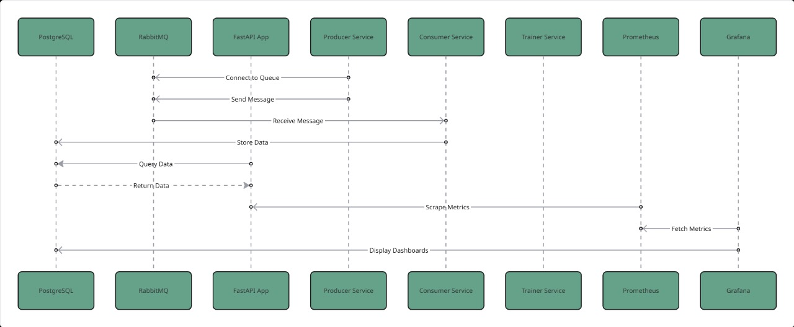
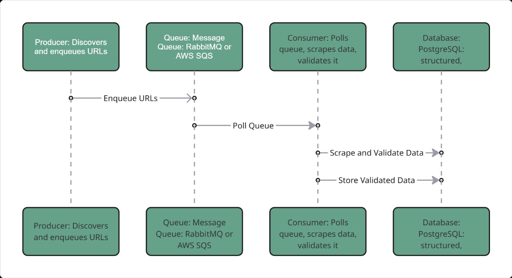
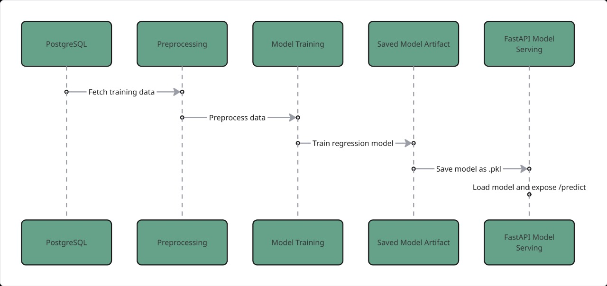
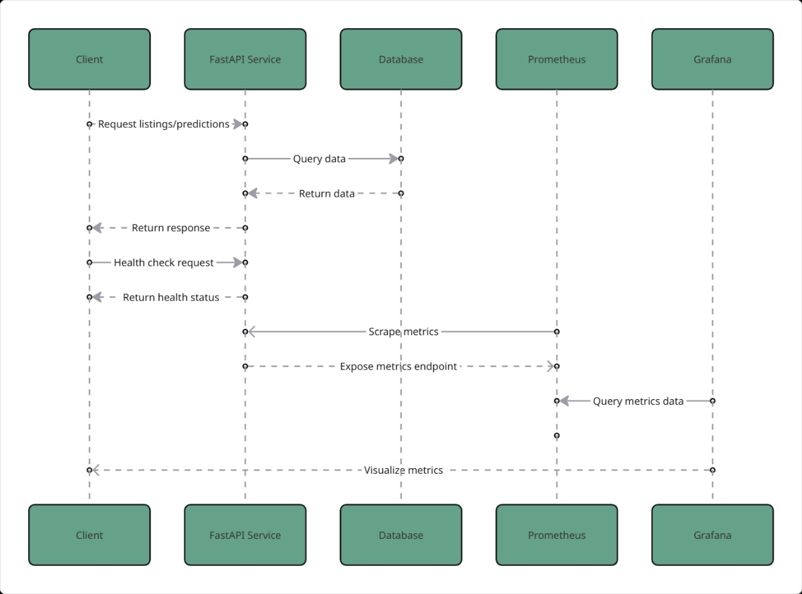

# 🏗️ System Architecture

The Property Intelligence Pipeline is based on a **Producer–Consumer model**, augmented with a Machine Learning pipeline and full observability stack.

---

## 🔄 End-to-End Data Flow
1. **Producer** discovers property URLs and enqueues them into **AWS SQS**.  
2. **Consumer** polls SQS, scrapes details, validates data, and persists into **PostgreSQL**.  
3. **FastAPI** exposes the data, analytics, and ML predictions.  
4. **Prometheus & Grafana** provide full observability.  
5. **ML Pipeline** trains rent prediction models using historical data.  

---

## 📊 Diagrams

### High-Level Overview

### System Flow

### ML Pipeline

### FastAPI flow

