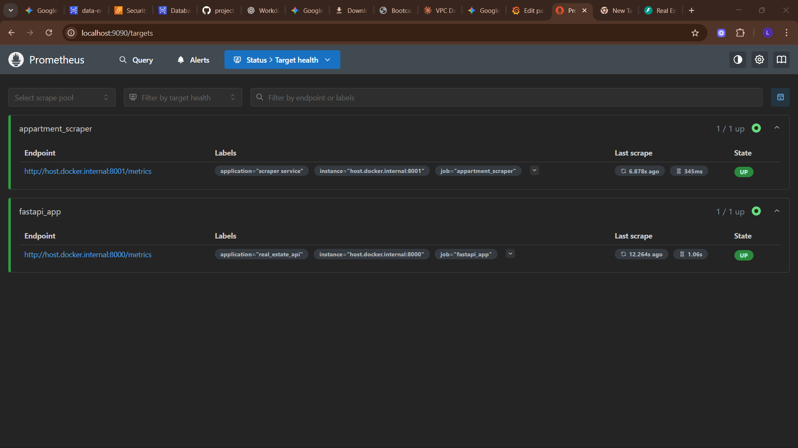
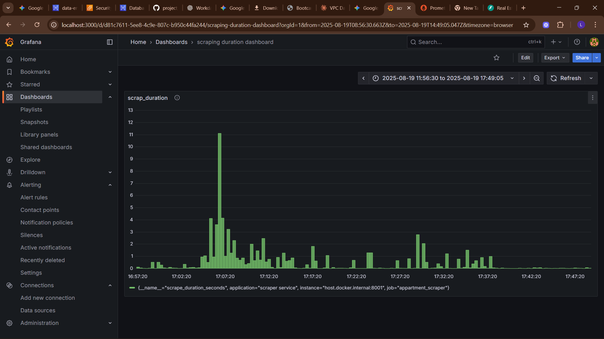

# 📊 Observability & Monitoring

The pipeline has full observability with **Prometheus + Grafana**.

---

## 🔑 Custom Metrics
Defined in `metrics.py`:
- `SCRAPER_SUCCESS`, `SCRAPER_FAILURES`
- `LISTINGS_SCRAPED`
- `VALIDATION_SUCCESS`, `VALIDATION_FAILURES`
- `DB_INSERT_FAILURES`
- `CPU_USAGE`, `MEMORY_USAGE`
- API request count & latency

---

## ⚙️ Prometheus Config
- Scrapes metrics from:
  - FastAPI (`:8000/metrics`)
  - Consumer service (`:8001/metrics`)
- Scrape interval: 15s

---

## 📈 Grafana
- Pre-provisioned data source (Prometheus).
- Dashboards:
  - Scraper health
  - API latency
  - DB inserts
  - Resource usage

---

## 🚨 Alerts
Recommended alerts:
- Scraper failures > 5/min
- DB insert failures spike
- API latency > 2s
- CPU usage > 80%
